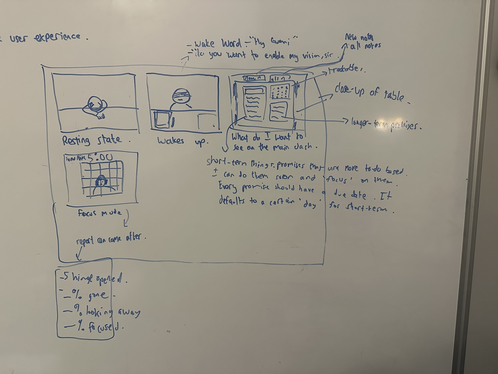
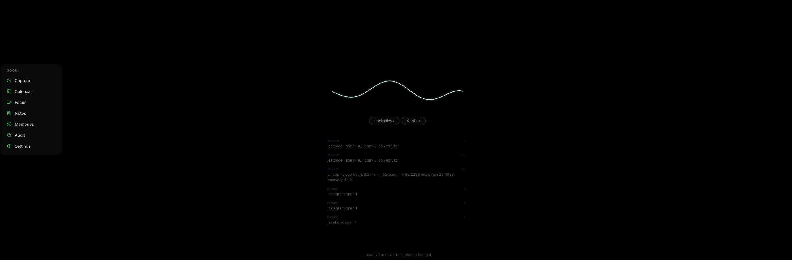
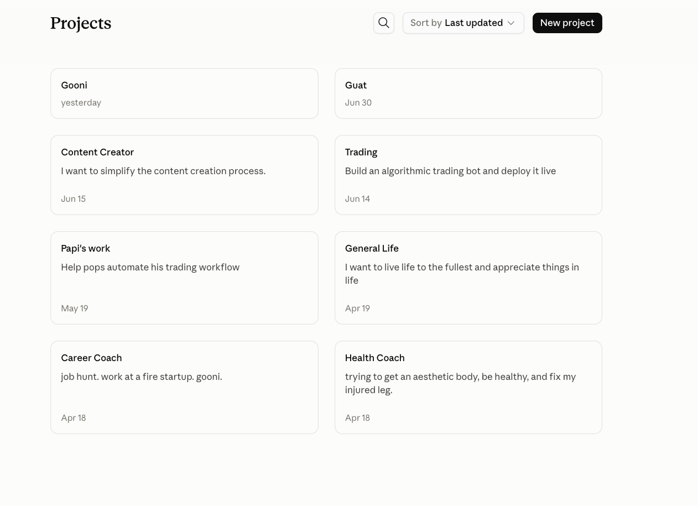

# 2026-07-28 — Gooni's dashboard

Session ran past midnight into 07-29. Whiteboard + grill session, then the build.

---

## What's wrong with what we have

**1. The log is stupid.** I don't really want to view all this data. I want it to be analyzed for
me. The `/home` page looks much better in this case, even though it isn't perfect.

**2. There's so much empty space.** This wave thing is fancy, but it's not needed.

Look at what the rail is actually telling me: `leetcode · streak 10, today 0, solved 312` twice in
a row, `instagram open 1`, `instagram open 1`, `facebook open 1`. Three rows to say I opened two
apps. That's the whole problem in one screenshot — it's a feed of pings, not a read on my day.

---

## The whiteboard, transcribed

**Storyboard panels:**

1. **Resting state** — Gooni asleep on the desk.
2. **Wakes up** — Gooni awake behind the desk.
   - Wake word: "Hey Gooni"
   - "Do you want to enable my vision, sir?"
3. **Main dash** — "What do I want to see on the main dash."
   - Tabs at top: `new notes` / `all notes`
   - Left card: short-term promises
   - Right top: dot grid → **trackables** ("close-up of table")
   - Right bottom: **longer-term promises**
4. **Focus mode** — social apps behind bars, `5:00` timer. "Report can come after."
5. **Report:**
   - `5 Hinge opened`
   - `__% gone`
   - `__% looking away`
   - `__% focused`

**The paragraph:**

> Short-term things. Promises that are more to-do based ± I can do them soon and 'focus' on them.
> Every promise should have a due date. It defaults to a certain 'day' for short-term.

---

## The big realization

Those three panels aren't a storyboard of one session — **they're a state machine.**

Gooni has a resting state, where he's just sleeping on the desk. Then the wake-up state, where he
wakes up — that's the state where it's just Gooni awake behind the desk. I'll generally have this
be the case with my persistent display at home.

I think if my mouse moves, or the wake word fires, Gooni wakes up. And maybe it's not the mouse
that brings the dashboard — there's some convenient button on the table for the dashboard if I
need it.

**We should leverage Apple's Shortcuts call.** Whenever I leave the house, it should go back to
resting state. When I'm in the house, the monitor should be on, Gooni still sleeping.

Honestly — should we just keep the monitor on 24/7 with Gooni sleeping behind the desk? And with
my wake word "hey Gooni", that's when Gooni wakes up.

**Answer: yes, keep it on.** A screen that's off is furniture; a sleeping character is presence,
and presence is the whole north star. So don't spend the Shortcuts trigger on power — spend it on
*state*:

- leave house → `deep_rest` (dimmest, slowest breath, no data)
- arrive home → `rest` (Gooni stirs, still asleep)
- night window → deepest dim

Two real costs: OLED burn-in (mitigate with slow drift, dark palette, no static bright pixels —
non-issue on IPS/LCD) and light in a bedroom, which is the only good reason to actually cut the
panel. Mechanically, Fly can't turn my monitor off — that needs the local Mac
(`pmset displaysleepnow`), same box as the focus-cam sidecar. Backend stores *desired* state, the
kiosk/sidecar polls and reconciles. Same pattern as `/focus/cam/control`, already shipped, so
"monitor off" is free to add later. Not designing around it now.

---

## The Claude Projects detour

I kind of like this layout. Instead of projects, the dashboard could just be focuses. And there
could be a button for trackables, a button to add notes. I guess this would bring back Spaces,
lol — which technically is fine. Kind of like focuses. Spaces. And clicking on one of these either
takes you into the space where you have your notes, or there's probably a focus button and I can
easily focus on any of these.

Hmm, maybe not. No spaces — but still the same layout, and this is just where all the short-term
promises are, and we can focus.

**Verdict after arguing it out:**

- **Cards-as-promises = wrong fit.** Card grids are for heavy, heterogeneous, long-lived objects (a
  project has docs, chats, a description). A promise is one line plus a due date. Most have no
  description, so cards render half-empty. Density collapses from ~30 rows to ~8 cards. That's the
  exact "so much empty space" complaint, rebuilt on purpose.
- **Cards-as-focuses = right fit** — and the table already exists. `Topic` (self-FK `parent_id`,
  `salience`, `color`) **is** Spaces. It came back in the focus system under a different name, and
  the MCP connector already writes it (`create_topic`, thoughts hang off topics). Nothing to
  migrate if I want this later.
- **But the real catch:** the Projects grid is a *navigation* surface — names and dates, click to
  get content. My kiosk premise is "the display IS the proactivity". A grid of names at rest tells
  me nothing. The whiteboard dash tells me everything without a click. Different jobs.

So the whiteboard dash is home. The focuses grid, if it ever gets built, is a second surface — and
the cards have to carry live state (n due, last touched) or they don't earn the space.

---

## Decisions locked

| Fork | Decision |
|---|---|
| The arcs canvas / log | **Deleted from the dash.** Raw events never render as rows; anything event-derived shows as a deterministic roll-up (`instagram ×12`, not twelve lines). |
| Promise primitive | **Focus `Reminder` only.** v2 `Promise` is parked — not merged, not rendered. |
| Wake trigger | Mouse move **or** wake word → `awake`. Dashboard is a separate, deliberate button. |
| Gooni's resting form | **2D SVG/CSS sprite**, slow breathing loop. Not the 3D GLTF (24/7 WebGL = fans + heat), not the waveform. |
| Short vs long term | **Derived from `due_at`** — ≤7d → short-term, else long-term. Undated on create → today EOD. No migration. |
| Notes chips | `new` = inline composer (capture), `all` = browse. The dash needs a capture path since the wave is dying. |
| Focus session target | **One short-term promise.** The report is about that promise and offers "mark kept". |
| Cam as presence sensor | **No** — camera stays session-only. The privacy light keeps meaning "a session is running", which is what makes "do you want to enable my vision, sir" mean anything. |
| App jail | **Shortcuts bounce + report.** No entitlement needed. |
| Monitor | Stays on 24/7. Shortcuts changes *state*, not power. |

### On the app jail

Hinge is a phone app — the Mac can't touch it, and real iOS blocking needs the paid FamilyControls
entitlement. So:

- **Phone:** iOS Shortcuts automation on "App Opened: Hinge" → `POST /events` → `Open App: Gooni`.
  Entitlement-free, works today, and the bounce is real friction.
- **Mac:** the sidecar hides a blocklisted app via `osascript` when it goes frontmost mid-session.
- Everything unblockable still lands in the report. `5 Hinge opened · 2 bounced`.

---

## Best find of the night

**The focus-cam sidecar already exists and works.** `~/Desktop/projects/focus-cam` — Python +
MediaPipe, with `face_landmarker` / `hand_landmarker` / `efficientdet` models, a `gooni_client.py`,
and a reconcile-poll loop against `GET /focus/cam`.

It already computes `presence_pct`, `eyes_on_pct`, `active_pct`, `engaged_pct` and `focus_score`,
and POSTs them to `/focus/cam/sessions` — which Gooni already stores. So `% gone / % looking away /
% focused`, the exact three lines on the whiteboard, need **a render, not a pipeline.**

What's actually missing on the sidecar:

1. Session↔promise binding (sessions are anonymous today)
2. App-jail enforcement
3. launchd persistence — the README flags "not reboot-persistent yet", which a 24/7 device needs
4. Wake word (no audio path at all today)

---

## Parked threads

- **"Take ownership back of our own intelligence stack."** This is a re-litigation of the
  Claude-as-intelligence pivot from 07-23. Not tonight — writing it down so it doesn't evaporate.
- **The focuses grid.** `Topic` is already Spaces. If I want the Claude-Projects layout as a second
  surface, no migration is needed — but the cards have to carry live state.
- **`5 Hinge opened` vs the cam.** That line comes from iOS Shortcuts, not the webcam. The cam can
  detect phone-in-hand (the models are already loaded); the two signals are different and both
  belong in the report.
